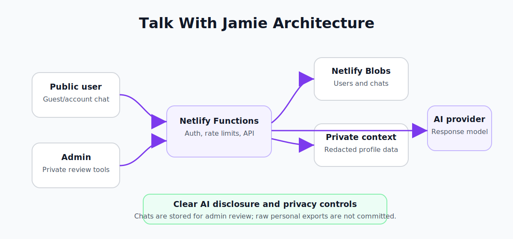

# Talk With Jamie

[](https://github.com/JamieP-205/talk-with-jamie/actions/workflows/ci.yml)

## Live site

The public experiment is available at [talkwithjamie.netlify.app](https://talkwithjamie.netlify.app/). Please note that guest chats are stored and may be reviewed by the administrator.

## Status

**Experimental, active development** this is a personal AI chat experiment. Features and privacy controls continue to evolve.

## Summary

Version 2 also supports one-time migration of legacy account hashes, conversations, and admin
threads, multiple persistent chats per account, and cross-platform relationship dossiers built
from locally held source exports. Its own deployment and privacy instructions are in
[`v2/README.md`](v2/README.md).

Talk With Jamie is a clearly disclosed AI chat experiment with optional accounts, guest sessions, persistent conversations and private administration tools. The app identifies itself as AI and warns users not to submit sensitive information. It persists conversations for registered and guest users, supports rate limiting, provides an admin dashboard and can switch between OpenAI-compatible and Cohere providers.

### Current recommended version

The recommended deployment is in [`v2/`](v2/). The root app is preserved for migration and history. New development happens in the `v2` folder. The migration guard prevents accidental replacement of the existing production backend until [MIGRATION.md](MIGRATION.md) is complete.

## Architecture overview

The app uses a static frontend served by Netlify alongside a serverless backend. Authenticated and guest users interact with Netlify Functions through signed `HttpOnly` cookies. Persistent users, conversations and rate limits are stored in Netlify Blobs. A separate admin interface retrieves a private context pack and allows conversation viewing, blocking and deletion. The configured AI provider (OpenAI-compatible or Cohere) generates responses based on a compact, redacted context pack.

| Talk With Jamie architecture |
| --- |
|  |

## Privacy first design choices

- Raw personal exports and private source files are **never** committed or deployed
- A compact, redacted context pack is generated locally and imported into a private Netlify Blob
- Admin‑only context is stored server‑side; public users receive only public‑safe context
- The interface identifies itself as AI and warns users not to submit sensitive information
- Sessions use signed `HttpOnly` cookies with `SameSite=Strict`, and passwords are hashed with scrypt
- Requests are size‑limited, cleaned, same‑origin checked and rate‑limited per route

## What I built

- Registered and guest chat sessions
- Signed `HttpOnly`, `SameSite=Strict` session cookies
- Scrypt password hashing
- Persistent users, conversations, contacts and rate limits with Netlify Blobs
- A private conversation viewer with block and deletion controls
- A private drafting workspace for contact‑specific reply ideas
- Configurable OpenAI-compatible or Cohere model providers
- Request size limits, input cleaning, same‑origin checks and route‑specific rate limits
- Automated unit, syntax, deployment‑guard and site‑structure tests

## Key files

- `index.html` – frontend shell and metadata
- `styles.css` – responsive public and admin interface styles
- `app.js` – client state, rendering and API requests
- `netlify/functions/api.js` – Netlify Function entry point
- `netlify/functions/_lib.js` – authentication, storage, validation, provider and route logic
- `test/` – unit tests for security‑sensitive helpers and deployment controls
- `tools/` – site validation and production migration guard

## Technical approach

The frontend is a lightweight static site that communicates with a single Netlify Function. Authentication is handled via signed, same‑site cookies; passwords use scrypt. The function uses a modular library for storage, validation and provider logic. Conversations and user records live in Netlify Blobs. A locally generated, redacted context pack helps the model produce replies that reflect my tone without exposing raw messages. The project is tested with unit and integration tests and guarded with a production migration flag to prevent accidental data loss.

## Deployment

The existing Netlify site is preserved, including its URL, environment variables and Blob
stores. GitHub is the source of truth: production builds use the `main` branch with `v2` as the
Netlify base directory. Pull requests and non-production branches use deploy previews.

Manual CLI deployment is kept for recovery and controlled storage migrations, not routine
changes.

## Local development

```bash
npm ci
npm test
npx netlify dev
```

The test suite checks authentication helpers, password hashing, signed sessions, username rules, message cleaning, frontend syntax, site structure and the production migration guard.

## Privacy & safety notes

Chats are stored and visible to the administrator. The application warns users not to submit sensitive information, and chat content is sent to the configured model provider when generating a response. Credentials, user exports, conversations and production data must never be committed. Review [PRIVACY.md](PRIVACY.md) and [SECURITY.md](SECURITY.md) before deploying a backend change.

## What I learned

This project taught me how to build a privacy‑conscious AI chat application from scratch. I learned to design authentication and rate‑limiting for anonymous and registered users, implement storage with Netlify Blobs, manage serverless functions and context packs, and be transparent with users about data collection. It also reinforced the importance of migration planning when evolving a live application.

## Future improvements

- Continue refining version 2 retrieval quality and relationship summaries
- Add client‑side accessibility enhancements for screen‑reader users
- Explore additional AI providers and experiment with retrieval‑augmented generation
- Build analytics dashboards to understand usage patterns while respecting user privacy

